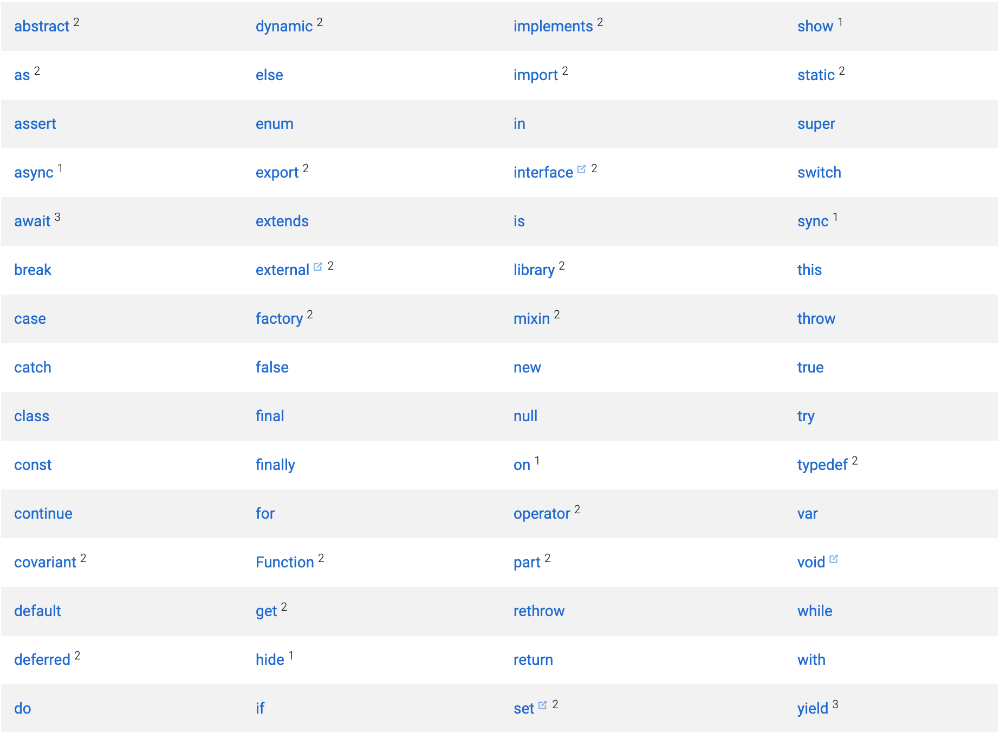
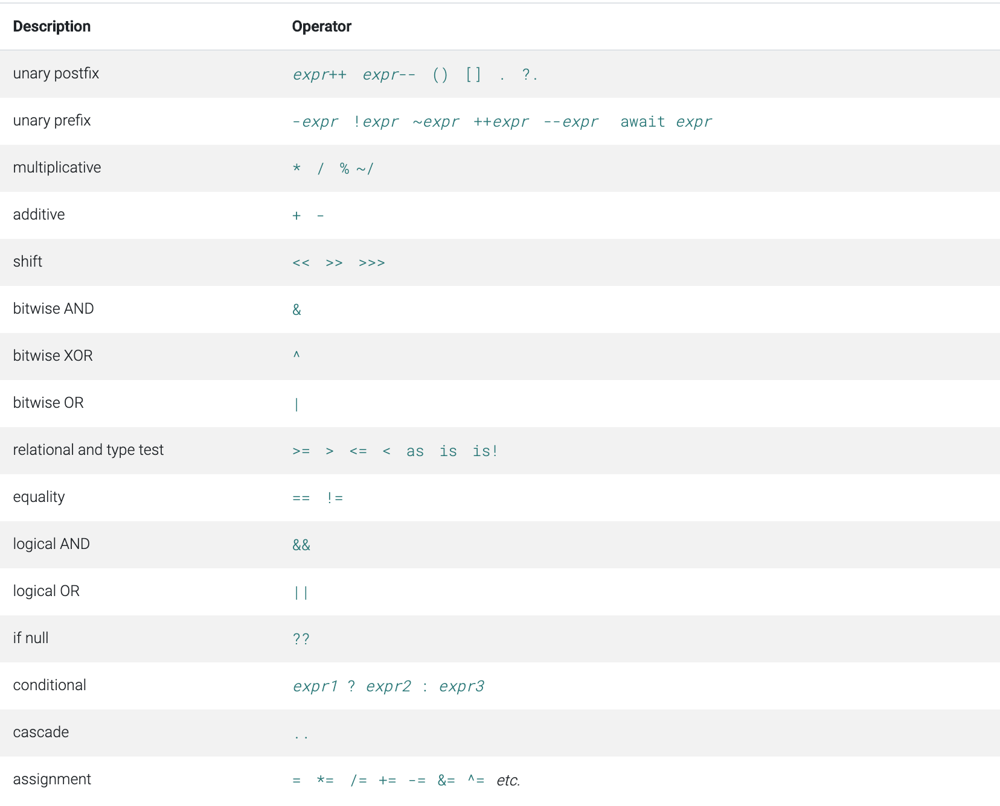

## Dart Language Tour

Flutter 프레임워크의 기반이 되는 Dart 언어에 대해 간략히 훑어보는 시간을 가져본다.

### #. 핵심 컨셉

- 다트 언어의 모든 것은 객체로 구성되어 있다. (함수 및 null 도 객체로 취급)
- 다트 언어는 강력한 타입 지정 언어이나, 타입 추론을 통해 타입을 생략할 수 있다.
- 다트에는 접근 제한자가 존재하지 않는다. 단 언더바(_)를 이용하여 private 형태로 사용 가능하다.


### #. Keywords

아래의 키워드 목록은 다트 언어에서 키워드로 지정되어 있으므로 사용이 불가능하다.




### #. 변수 선언

```dart
// 타입 추론을 통해 변수 name은 String 타입으로 인식된다.
var name = 'Bob';
dynamic name = 'Bob';

// 타입을 명시적으로 지정
String name = 'Bob';

// 초기화 되지 않은 변수의 초기화 값은 모두 null이다
int lineCount; // print(lineCount) == null

// final 또는 const 키워드를 사용하여 상수를 선언한다.
final name = 'Bob';
final String nickname = 'Bob';
const name = 'Bob';
```

- `final` vs `const`
  - 다트에서 final 과 const 는 둘다 상수를 지정하는 키워드이나 큰 차이점은 const는 compile time 상수라는 것.
  - 예를들어 DateTime.now() 같은 런타임에서 호출되어 정해지는 상수의 경우 const를 이용하여 상수로 지정할 수 없다.


### #. 데이터 타입

- numbers
- strings
- booleans
- lists (also known as *arrays*)
- sets
- maps
- runes (for expressing Unicode characters in a string)
- symbols

```dart
// numbers
int num1 = 10;
double num2 = 1; // 1.0

// strings
String name = 'Bob';
String greeting = 'Hello ${name}';

// booleans
bool isRunning = false;

// lists
var list = [1, 2, 3];
List<int> intList = [1, 2, 3];
List<String> nav = [
  'Home',
  'Furniture',
  'Plants',
  if (promoActive) 'Outlet'
];

// sets
var halogens = {'fluorine', 'chlorine', 'bromine', 'iodine', 'astatine'};
var names = <String>{};
Set<String> names = {};
// var names = {}; -> 유형에 대한 인수를 지정하지 않으면 다트의 컴파일러는 해당 문법을 map으로 추론한다.

// maps
var gifts = {
  // Key:    Value
  'first': 'partridge',
  'second': 'turtledoves',
  'fifth': 'golden rings'
};
Map<String, int> nobleGases = {
  2: 'helium',
  10: 'neon',
  18: 'argon',
};
var mapContructors = Map();
```


### #. 함수

```dart
// 다트에서의 함수 권장 사용법
// returnType functionName(args) {}
bool isNoble(int atomicNumber) {
  return _nobleGases[atomicNumber] != null;
}

// 함수의 반환 타입이 지정되지 않아도 타입추론을 통해 유추할 수 있지만, 권장하진 않는다.
isNoble(int atomicNumber) {
  return _nobleGases[atomicNumber] != null;
}

// 축약을 통해 아래와 같은 형태로 사용이 가능하다.
bool isNoble(int atomicNumber) => _nobleGases[atomicNumber] != null;

// Named parameters
void enableFlags({bool bold, bool hidden}) {...}
enableFlags(bold: true, hidden: false);

// 선택적 매개변수에서 필수값을 명시하기 위해 @required 를 사용한다.
// @required 키워드는 meta 패키지를 통해 제공받을 수 있다.
const Scrollbar({Key key, @required Widget child});

// Default Parameters
void enableFlags({bool bold = false, bool hidden = false}) {...}

// Entry Point
// The .. syntax in the preceding code is called a cascade. With cascades, you can perform multiple operations on the members of a single object.
void main() {
  querySelector('#sample_text_id')
    ..text = 'Click me!'
    ..onClick.listen(reverseText);
}

// Anonymous functions
var list = ['apples', 'bananas', 'oranges'];
list.forEach((item) {
  print('${list.indexOf(item)}: $item');
});
```


### #. Operators




### #. Control flow statements

```dart
// if statement
if (isRaining()) {
  you.bringRainCoat();
} else if (isSnowing()) {
  you.wearJacket();
} else {
  car.putTopDown();
}

// for loop
var message = StringBuffer('Dart is fun');
for (var i = 0; i < 5; i++) {
  message.write('!');
}

// forEach
candidates.forEach((candidate) => candidate.interview());

// while loop
while (!isDone()) {
  doSomething();
}

do {
  printLine();
} while (!atEndOfPage());

// switch case
var command = 'OPEN';
switch (command) {
  case 'CLOSED':
    executeClosed();
    break;
  case 'PENDING':
    executePending();
    break;
  case 'APPROVED':
    executeApproved();
    break;
  case 'DENIED':
    executeDenied();
    break;
  case 'OPEN':
    executeOpen();
    break;
  default:
    executeUnknown();
}
```


### #. Classes

```dart
// Using class members
var p = Point(2, 2);
p.y = 3;
num distance = p.distanceTo(Point(4, 4));
// optional chaining
p?.y = 4;

// Getting an object’s type
print('The type of a is ${a.runtimeType}');

// Redirecting constructors
class Point {
  num x, y;

  Point(this.x, this.y);
  Point.alongXAxis(num x) : this(x, 0);
}

// Constant constructors
class ImmutablePoint {
  static final ImmutablePoint origin = const ImmutablePoint(0, 0);

  final num x, y;

  const ImmutablePoint(this.x, this.y);
}

// Factory constructors
class Logger {
  final String name;
  bool mute = false;

  // _cache is library-private, thanks to
  // the _ in front of its name.
  static final Map<String, Logger> _cache =
      <String, Logger>{};

  factory Logger(String name) {
    return _cache.putIfAbsent(
        name, () => Logger._internal(name));
  }

  Logger._internal(this.name);

  void log(String msg) {
    if (!mute) print(msg);
  }
}

// Instance methods
import 'dart:math';

class Point {
  num x, y;

  Point(this.x, this.y);

  num distanceTo(Point other) {
    var dx = x - other.x;
    var dy = y - other.y;
    return sqrt(dx * dx + dy * dy);
  }
}

// Getters and setters
class Rectangle {
  num left, top, width, height;

  Rectangle(this.left, this.top, this.width, this.height);

  num get right => left + width;
  set right(num value) => left = value - width;
  num get bottom => top + height;
  set bottom(num value) => top = value - height;
}

void main() {
  var rect = Rectangle(3, 4, 20, 15);
  assert(rect.left == 3);
  rect.right = 12;
  assert(rect.left == -8);
}

// Abstract methods
abstract class Doer {
  void doSomething();
}

class EffectiveDoer extends Doer {
  void doSomething() {
    // code..
  }
}

// Using enums
enum Color { red, green, blue }

// Adding features to a class: mixins
class Musician extends Performer with Musical {
  // ···
}

class Maestro extends Person with Musical, Aggressive, Demented {
  Maestro(String maestroName) {
    name = maestroName;
    canConduct = true;
  }
}

mixin Musical {
  bool canPlayPiano = false;
  bool canCompose = false;
  bool canConduct = false;

  void entertainMe() {
    if (canPlayPiano) {
      print('Playing piano');
    } else if (canConduct) {
      print('Waving hands');
    } else {
      print('Humming to self');
    }
  }
}
```


### #. Generic

```dart
// Basic
abstract class Cache<T> {
  T getByKey(String key);
  void setByKey(String key, T value);
}

// Restricting the parameterized type
class Foo<T extends SomeBaseClass> {
  String toString() => "Instance of 'Foo<$T>'";
}

class Extender extends SomeBaseClass {...}

var someBaseClassFoo = Foo<SomeBaseClass>();
var extenderFoo = Foo<Extender>();

// Using generic methods
T first<T>(List<T> ts) {
  T tmp = ts[0];
  return tmp;
}
```


### #. 비동기 지원

```dart
Future checkVersion() async {
  var version = await lookUpVersion();
  // Do something with version
}
```


### #. TODO

- 비동기 지원 관련: `async`/`await` & `stream`

- Isolates
- Typedefs
- Metadata