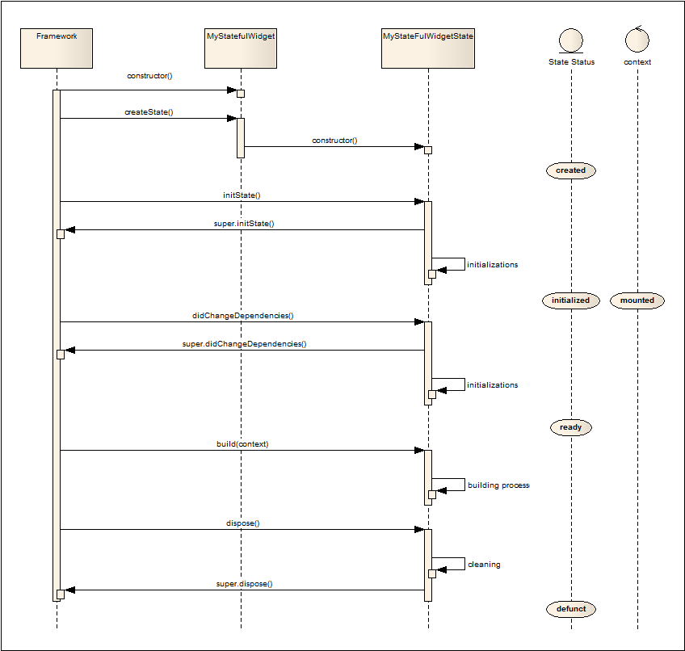
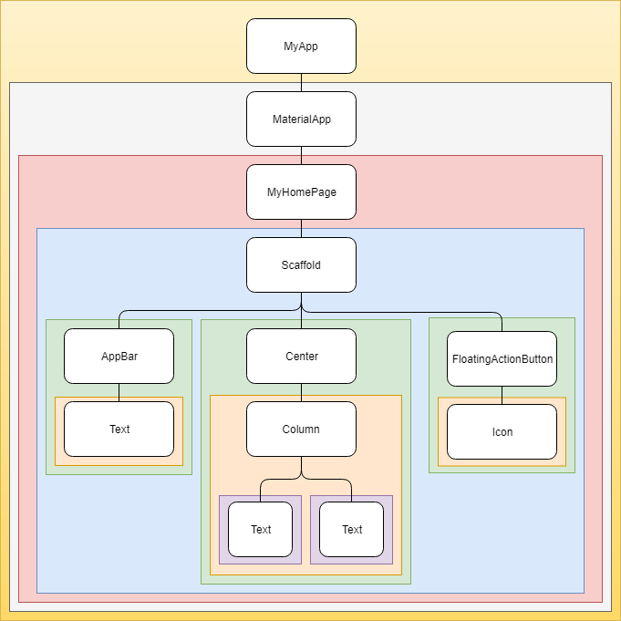
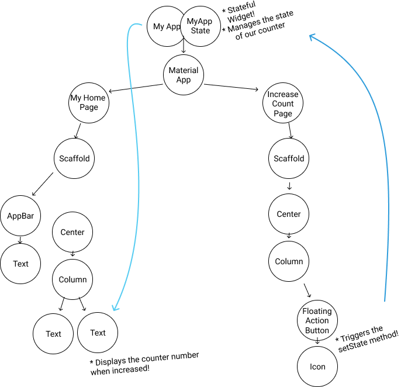
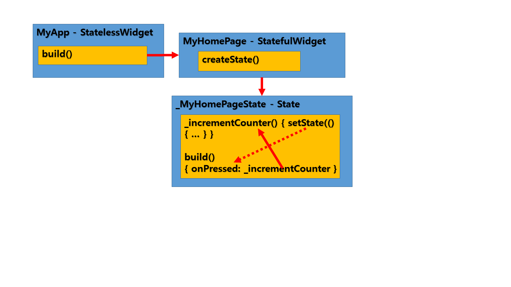

# State Management

반응 형 앱의 상태 관리에 익숙한 경우 skip 가능


여러 앱 화면 간 상태를 공유해야 할 때 있으며, 취할 수 있는 많은 접근 방식 등을 고려해야 함.


## Start thinking declaratively

Android SDK나 iOS UIKit 같은 명령형 프레임워크를 하다 Flutter로 온 경우 앱 개발시 새로운 관점에서 생각해야 함.

예로 UI를 수정하지 않고 처음부터 다시 빌드함.

Flutter는 필요한 경우 모든 프레임에서조차 그렇게 할 수 있을 만큼 빠름.

Flutter는 선언적임(declarative). 즉, Flutter는 앱의 현재 상태를 반영하기 위해 유저 인터페이스를 빌드함.


앱 상태가 변경되면 UI가 다시 그려짐. (설정화면에서 스위치 플립같은 경우)

UI 자체를 변경하지 않아도 상태 변경시 다시 빌드함.


UI 프로그래밍에 대한 선언적 접근방식 :  https://flutter.dev/docs/get-started/flutter-for/declarative 


UI 프로그래밍에 대한 선언적 스타일에는 많은 이점이 있음.

UI 상태에 대한 코드 경로는 오직 하나이며, 주어진 상태에 대해 UI가 어떻게 보이는지 설명함.


처음에는 명령형 스타일만큼 직관적이지 않을 수 있음.


## Differentiate between ephemeral state and app state

앱 상태(App state) : 앱이 실행될 때 메모리에 존재하는 모든 것.

앱의 assets이나 Flutter Framework이 UI, 애니메이션 상태, 텍스처, 글꼴 등에 대해 유지하는 모든 변수가 포함.

상태의 폭 넓은 선언은 유효하지만, 앱 설계를 위해서 매우 유용하지는 않음.


첫째, 텍스처와 같은 일부 상태도 관리하지 않고 프레임워크가 이를 처리함.

따라서 상태에 대한 보다 유용한 정의는 "언제든지 UI를 다시 작성하는데 필요한 데이터".

둘째, 임시 상태와 앱 상태, 두 가지 개념 유형으로 분리하여 스스로 관리할 수 있음.


### Ephemeral state

임시 상태(UI 상태 또는 local 상태로도 불림)는 단일 위젯에 깔끔하게 포함할 수 있는 상태.

의도적으로 모호한 정의임.

* `PageView` 의 현재 페이지
* 복잡한 애니메이션의 현재 진행 상황
* `BottomNavigationBar` 의 현재 선택된 탭

위젯 트리의 다른 부분은 이러한 종류의 상태에 액세스할 필요가 거의 없음.

직렬화할 필요가 없고, 복잡한 방식으로 변경되지도 않음.

즉, 이런 종류의 상태에 대해 상태 관리 기술(ScopedModel, Redux 등) 을 사용할 필요가 없음.

`StatefulWidget` 이 필요한 전부임.

아래에서 하단 네비게이션 바에서 현재 선택된 항목 `_index`가 `_MyHomepageState` 클래스 내 필드에 어떻게 유지되는지 볼 수 있음. 이 예에서 `_index`가 임시 상태임.

```dart
class MyHomepage extends StatefulWidget {
  @override
  _MyHomepageState createState() => _MyHomepageState();
}

class _MyHomepageState extends State<MyHomepage> {
  int _index = 0;

  @override
  Widget build(BuildContext context) {
    return BottomNavigationBar(
      currentIndex: _index,
      onTap: (newIndex) {
        setState(() {
          _index = newIndex;
        });
      },
      // ... items ...
    );
  }
}
```

`setState()` 와 `StatefulWidget` 의 `State` 클래스 내부의 필드를 사용하는 것은 완전히 자연스러움.

앱의 다른 부분에는 액세스할 필요 없음.

`_index` 변수는 `MyHomepage` 위젯 내에서만 변경됨.

또한 사용자가 앱을 닫았다가 다시 시작해도 `_index`는 0으로 재설정 됨.


### App State

임시 상태가 아니고 앱의 여러 부분에서 공유하고 사용자 세션 간에 유지하려는 상태는 App State (또는 공유 상태라고도 함)임.

적용 상태의 예 :

* 사용자 환경 설정
* 로그인 정보
* 소셜 네트워킹 앱의 알림
* 전자 상거래 앱의 장바구니
* 뉴스 앱에서 기사 읽기 / 읽지 않은 상태


앱 상태를 관리하려면 옵션을 조사해야 함. 선택은 앱의 복잡성과 특성, 팀의 이전 경험 및 기타 여러 측면에 따라 다름.


### There is no clear-cut rule

명확하게하기 위해 `State` 및 `setState()`를 사용하여 앱의 모든 상태를 관리 할 수 있음.

실제로 Flutter 팀은 많은 간단한 앱 샘플에서 이 작업을 수행함.

(모든 플러터 생성과 함께 제공되는 스타터 앱 포함)


다른 경우도 있음. 

특정 앱의 컨텍스트에서 아래쪽 탐색 모음의 선택된 탭이 임시상태가 아닌 것으로 결정할 수 있음.

클래스 외부에서 변경하고 세션 간에 유지하는 등의 작업이 필요할 수 있음.

이 경우 `_index` 변수는 앱 상태임.


특정 변수가 일시적인지 앱 상태인지 구분하기 위한 명확하고 보편적인 규칙은 없음.

때로는 하나를 다른 것으로 리팩토링해야 함.

예로 분명한 임시 상태로 시작하지만 앱 기능이 커짐에 따라 앱 상태로 이동해야 하는 함.


이러한 이유로 다음과 같은 다이어그램을 가져옴.


Redux의 저자 Dan Abramov는 React의 `setState`와 Redux의 store에 대한 질문에 다음과 같이 답함.

"The rule of thumb is: Do whatever is less awkward."

경험 상의 규칙은... 덜 어색한 것으로 하세요.


Flutter 앱에는 두 가지 개념적 유형의 상태가 있음.

임시 상태는 `State`와 `setState()` 를 이용하여 구현할 수 있고, 종종 하나의 위젯에 대한 로컬임.

나머지는 앱 상태임.

두 유형 모두 Flutter 앱에서 사용할 수 있으며 구분은 선호도 및 앱 복잡성에 따라 달라짐.


## Sample

```dart
class MyStatefulWidget extends StatefulWidget {

	MyStatefulWidget({
		Key key,
		this.parameter,
	}): super(key: key);
	
	final parameter;
	
	@override
	_MyStatefulWidgetState createState() => new _MyStatefulWidgetState();
}

class _MyStatefulWidgetState extends State<MyStatefulWidget> {

	@override
	void initState(){
		super.initState();
		
		// Additional initialization of the State
	}
	
	@override
	void didChangeDependencies(){
		super.didChangeDependencies();
		
		// Additional code
	}
	
	@override
	void dispose(){
		// Additional disposal code
		
		super.dispose();
	}
	
	@override
	Widget build(BuildContext context){
		return new ...
	}
}
```





```dart
import 'package:flutter/material.dart';

void main() => runApp(MyApp());

class MyApp extends StatelessWidget {
  // This widget is the root of your application.
  @override
  Widget build(BuildContext context) {
    return MaterialApp(
      title: 'Flutter Demo',
      theme: ThemeData(
        primarySwatch: Colors.green,
      ),
      home: MyHomePage(title: 'Flutter Demo Home Page'),
    );
  }
}

class MyHomePage extends StatefulWidget {
  MyHomePage({Key key, this.title}) : super(key: key);

  final String title;

  @override
  _MyHomePageState createState() => _MyHomePageState();
}

class _MyHomePageState extends State<MyHomePage> {
  int _counter = 0;

  void _incrementCounter() {
    setState(() {
      _counter++;
    });
  }

  @override
  Widget build(BuildContext context) {
    return Scaffold(
      appBar: AppBar(
        title: Text(widget.title),
      ),
      body: Center(
        child: Column(
          mainAxisAlignment: MainAxisAlignment.center,
          children: <Widget>[
            Text(
              'You have pushed the button this many times:',
            ),
            Text(
              '$_counter',
              style: Theme.of(context).textTheme.display1,
            ),
          ],
        ),
      ),
      floatingActionButton: FloatingActionButton(
        onPressed: _incrementCounter,
        tooltip: 'Increment',
        child: Icon(Icons.add),
      ),
    );
  }
}

```










