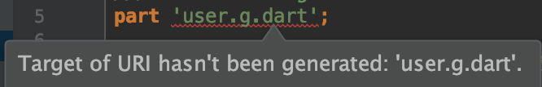

# JSON

아래 Flutter 공식 문서를 참고하여 작성된 스터디 자료입니다.

: https://flutter.dev/docs/development/data-and-backend/json 

: https://flutter.dev/docs/cookbook/networking/background-parsing


## 개요

##### 용어

Encoding, Serialization: Data Structure를 String으로 변경.

* Serialization: 일반적으로, 데이터를 읽기 쉬운 형식으로 변환하는 전체 프로세스를 의미함.


##### JSON 2가지 전략

1) Manual Serialization (수동 직렬화)

2) Automated Serialization using code generation (코드 생성을 통한 자동 직렬화)

``` dart
프로젝트의 규모/복잡도에 따라 선택
```


## Manual Serialization

- 작은 프로젝트 (프로토타이핑)
  - 장점: 외부 dependency 없음, 빠른 컨셉증명에 용이함.
- 내장 JSON decoder 사용: <span style="color:blue">dart:convert</span>
  -  <span style="color:blue">jsonDecode()</span>  ->  <span style="color:blue">Map<String, dynamic></span>  
  - `dynamic ` : 런타임까지 value type을 알 수 없음. (Compile-time exception 없음.)


## Automated Serialization

* 중간규모 이상 프로젝트
  * 장점: boilerplate 작성 필요 없음, JSON 필드 접근 오류가 컴파일 타임에 발생. 
  * 단점: 자동 생성된 소스파일이 혼란을 줄  수 있음.
  
* 라이브러리 사용: [json_serializable](https://pub.dev/packages/json_serializable),  [built_value](https://pub.dev/packages/built_value)

  

## Manual Serialization 실습

* Fluuter에 내장된 <span style="color:blue">dart:convert</span> 라이브러리
  * 간단한 JSON encoder/decoder


###### JSON 예제

```json
{
  "name": "Daisy",
  "email": "daisy@jsonWorld.com"
}
```

=> <span style="color:blue">dart:convert</span> 를 사용하면( <span style="color:blue">import 'dart:convert';</span> ) , 2가지 방법으로 Serialization 할 수 있다.


###### [방법1] JSON Inline

```dart
Map<String, dynamic> user = jsonDecode(jsonString);

print('성함: ${user['name']} 님');
print('email 주소: ${user['email']}');
```


###### [방법2] Model 클래스

```dart
class User {
  final String name;
  final String email;

  User(this.name, this.email);

  /// Unit test 필요
  User.fromJson(Map<String, dynamic> json) 
      : name = json['name'],
        email = json['email'];

  Map<String, dynamic> toJson() =>
    {
      'name': name,
      'email': email,
    };
}
```

* Serialization 로직이 model 클래스의 내부에 속함.

  

```dart
/// Map userMap = jsonDecode(jsonString);
String json = jsonEncode(user); /// toJson() 호출 필요 없음.
var user = User.fromJson(userMap);

print('성함: ${user.name} 님');
print('email 주소: ${user.email}');
```


## Automated Serialization 실습

###### [Step1] dependency 세팅

* pubspec.yaml 파일에 dependencies 추가

```yaml
dependencies:
  # 1 regular dependency 
  json_annotation: ^2.4.0

dev_dependencies:
  # 2 dev dependencies (Not included in a app source, only for development environment)
  build_runner: ^1.6.0
  json_serializable: ^3.0.0
```

- `$ flutter pub get`  실행 ( 루트 폴더), 또는 package_get 클릭

### 


###### [Step2] Model 클래스 (json_serializable 방법)

```dart
import 'package:json_annotation/json_annotation.dart';

/// User 클래스가 생성된 파일의 private 멤버들에 접근 가능하도록 함.
/// build_runner에 의해 생성된 파일: *.g.dart
part 'user.g.dart';

/// code generator에게 JSON serialization 로직 생성이 필요한 클래스임을 알려줌.
@JsonSerializable()
class User {
  User(this.name, this.email);

  /// (option) API가 리턴하는 key값을 변경하여 사용하고자 할 때. (ex. snake_case -> lowerCamelCase)
  @JsonKey(name: 'user_name')
  String name;
  String email;

  /// 자동 생성된 _$UserFromJson() 생성자로 맵을 전달.
  factory User.fromJson(Map<String, dynamic> json) => _$UserFromJson(json);

  /// 자동 생성된 _$UserToJson()
  Map<String, dynamic> toJson() => _$UserToJson(this);
}
```

* 위의 코드를 실행하고자 할떄, 아래와 같은 에러메세지를 만나게 됨.

###### 


##### 해결 방법

* `$ flutter pub run build_runner build`  실행 (루트 폴더)
  * 1회 빌드.

* `$ flutter pub run build_runner watch`  실행 (루트 폴더)	
  * 파일 변경 발생 시, 빌드
  *  watcher는 1번 시작하고, 백그라운드에서 계속 실행되도록 두는 것이 안전함.


###### [Step2-1] Model 클래스가 중첩 클래스를 포함할 떄

```dart
import 'address.dart';
import 'package:json_annotation/json_annotation.dart';
part 'user.g.dart';

/// (explicitToJson: true) 옵션 추가 전 user.toJson()
/// : {name: Daisy, address: Instance of 'address'}
/// 옵션 추가 후:  {name: Daisy, address: {street: My st., city: New York}}
@JsonSerializable(explicitToJson: true)
class User {
  String name;
  Address address; /// 중첩 클래스 (nested class)

  User(this.name, this.address);

  factory User.fromJson(Map<String, dynamic> json) => _$UserFromJson(json);
  Map<String, dynamic> toJson() => _$UserToJson(this);
}
```

```dart
import 'package:json_annotation/json_annotation.dart';
part 'address.g.dart';

@JsonSerializable()
class Address {
  String street;
  String city;

  Address(this.street, this.city);

  factory Address.fromJson(Map<String, dynamic> json) => _$AddressFromJson(json);
  Map<String, dynamic> toJson() => _$AddressToJson(this);
}
```


###### 테스트 실행 코드

```dart
Address address = Address("My st.", "New York");
User user = User("John", address);
print(user.toJson());
```


## 백그라운드  JSON 파싱

* Dart는 기본적으로 Single Thread
* Android: 다른 Thread,  Flutter: 별도의 isolate


##### step1. http 패키지 추가

* pubspec.yaml

```yaml
dependencies:
  # https://pub.dev/packages/http#-installing-tab- (최신버전 확인)
  http: ^0.12.0+2
```


##### step2. 네트워크 request 생성

```dart
Future<http.Response> fetchPhotos(http.Client client) async {
  return client.get('https://jsonplaceholder.typicode.com/photos');
}
```

* [jsonplaceholder](https://jsonplaceholder.typicode.com/ ) 는 JSON 데이터가 필요한 프로젝트에서 무료로 JSON API테스트를 위해 사용할 수 있음.


#####  step3. JSON 파싱 및 변환

###### 3-1. Model 클래스 생성

```json
{
    "albumId": 1,
    "id": 1,
    "title": "accusamus beatae ad facilis cum similique qui sunt",
    "url": "https://via.placeholder.com/600/92c952",
    "thumbnailUrl": "https://via.placeholder.com/150/92c952"
  }
```

```dart
class Photo {
  final int id;
  final String title;
  final String thumbnailUrl;

  Photo({this.id, this.title, this.thumbnailUrl}); // 생성자 {}로 감싸면, optional

  factory Photo.fromJson(Map<String, dynamic> json) {
    return Photo(
      id: json['id'] as int,
      title: json['title'] as String,
      thumbnailUrl: json['thumbnailUrl'] as String,
    );
  }
}
```


###### 3-2. Model 리스트로 변환

```dart
// response body -> List<Photo>
List<Photo> parsePhotos(String responseBody) {
  final parsed = json.decode(responseBody).cast<Map<String, dynamic>>(); // jsonDecode
  return parsed.map<Photo>((json) => Photo.fromJson(json)).toList();
}
```


##### step4. 별도의  isolate 로 이동시킴

```dart
Future<List<Photo>> fetchPhotos(http.Client client) async {
  final response = await client.get('https://jsonplaceholder.typicode.com/photos');

  // compute(): parsePhotos를 별도의 isolate 로 실행시킴.
  return compute(parsePhotos, response.body);
}
```

* 주의: primitive value (null, num, String..) 또는 간단한 객체 (List<Photo>) 정도  사용가능 

  ​        더 복잡한 object들 (Future, http.Response..) 를 isolate 간 전달 하려고 하면, 오류 발생

  

### 참고

* FutureBuilder: https://www.youtube.com/watch?v=ek8ZPdWj4Qo
* Dio: https://pub.dev/packages/dio
