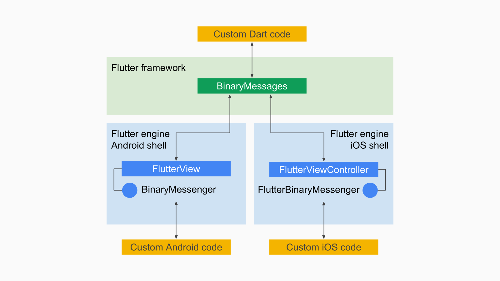
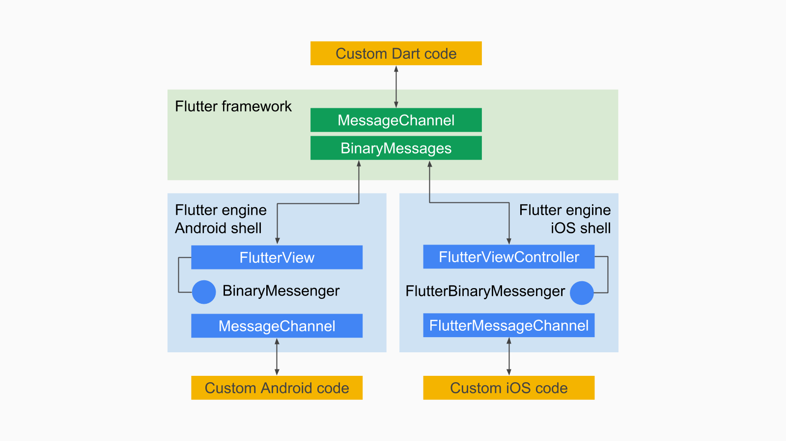

# Native 플랫폼 코드 연동하기 (iOS)

## 참고자료

- [Writing custom platform-specific code - Flutter ](https://flutter.dev/docs/development/platform-integration/platform-channels)
- [Flutter Platform Channels - Flutter - Medium](https://medium.com/flutter/flutter-platform-channels-ce7f540a104e)
- [Building for iOS with Flutter (Google I/O&#39;19) - YouTube](https://www.youtube.com/watch?v=ZBJa-xjZl3w&t=34s)

## 네이티브 코드와 연동이 필요한 이유

- Flutter/Dart로는 UI를 그리는 것은 잘한다.
- File IO나 Network IO도 할 수 있다.
- 그러나 그 외에 디바이스와 밀접한 기능은 Flutter가 다루지 않는다.
  - 푸시 알림, 앱 라이프사이클, 딥링크,...
  - 센서, 카메라, 배터리, 위치, 소리, 연결성,...
  - 다른 앱들과 정보 공유, 다른 앱을 실행시키기,...
  - 디스크에 저장된 설정, 특별한 폴더들, 디바이스 정보,...

플랫폼에 밀접한 기능들은 Flutter가 다룬다고 하더라도 각 OS가 업데이트 되면서 옛날 것이 되기 쉽다.
워낙 종류가 많고, 플랫폼마다 달라서, 이것들을 다 최신 수준으로 지원하기 어렵다.

그래서 Flutter 팀의 선택은...

- 이런 기능들은 Flutter Core에 포함시키지 않고, 필요한 경우, 각각 Native 플랫폼 코드로 작성하게 함.
- 그리고 Flutter/Dart 코드와 플랫폼 코드 사이에 플랫폼 채널이라는 간단하고 일반적인 통신 채널을 제공
- 즉, Flutter가 제공하지 않는 기능이 필요할 때는 Native 코드로 기능을 작성하고 채널을 통해 요청과 결과를 주고 받도록 함.
- 이 채널은 양방향으로 메시지를 주고 받을 수 있음. 따라서 네이티브 코드로 작성한 부분을 Flutter/Dart 코드에서 호출할 수도 있고, 반대로 네이티브 코드에서 이벤트를 받아서 Flutter/Dart에 작성된 API를 호출할 수도 있다.

그리고 이렇게 네이티브 플랫폼 코드로 작성한 기능을 Dart API와 함께 패키지로 감싸서 공유하도록 하였고, 이런 패키지를 플러그인이라고 한다. 즉, 다른 사람이 만들어 배포한 플러그인을 이용하면 직접 네이티브 플랫폼 코드를 작성하지 않고 Dart API로 해당 기능을 사용할 수 있다.

## 플랫폼 채널

플랫폼 코드는 사용하는 기본적인 개념은 간단하다.


Flutter 코드는 각 플랫폼별 컴포넌트로 감싸져 있는 형태로 되어 있다.

- Android: `View` => `FlutterView`
- iOS: `UIViewController` => `FlutterViewController`

따라서 Flutter의 환경이 되는 플랫폼별 컴포넌트에서 각 플랫폼의 네이티브 코드로 네이티브에서 할 수 있는 어떤 코드라도 작성할 수 있다. 필요한 것은 Flutter 코드와 네이티브 코드가 서로 통신할 수 있는 수단이다.
이를 위해 Flutter 와 Flutter를 위한 네이티브 컴포넌트에는 통신을 위한 채널이 구현되어 있다. 이러한 채널에는 여러 레벨이 있지만, 주로 쓰게 되는 것은 method channel이다.


### Binary Messenger

기본적으로 Flutter-플랫폼 간의 메시지는 binary format으로 주고 받는다. 이를 각각 플랫폼에서 처리하는 BinaryMessenger가 있다.



- `foo` 채널로 ByteData 메시지를 보내는 Dart 코드 (BinaryMessage는 deprecated되고 BinaryMessenger를 사용해야 함?)

  ```dart
  // Send a binary message from Dart to the platform.
  final WriteBuffer buffer = WriteBuffer()
    ..putFloat64(3.1415)
    ..putInt32(12345678);
  final ByteData message = buffer.done();
  await BinaryMessages.send('foo', message);
  print('Message sent, reply ignored');
  ```

- 위의 ByteData를 안드로이드에서 받기 위한 Kotlin 코드
  ```kotlin
  // Receive binary messages from Dart on Android.
  // This code can be added to a FlutterActivity subclass, typically
  // in onCreate.
  flutterView.setMessageHandler("foo") { message, reply ->
    message.order(ByteOrder.nativeOrder())
    val x = message.double
    val n = message.int
    Log.i("MSG", "Received: $x and $n")
    reply.reply(null)
  }
  ```
- 위의 ByteData를 iOS에서 받기 위한 Swift 코드
  ```swift
  // Receive binary messages from Dart on iOS.
  // This code can be added to a FlutterAppDelegate subclass,
  // typically in application:didFinishLaunchingWithOptions:.
  let flutterView =
    window?.rootViewController as! FlutterViewController;
  flutterView.setMessageHandlerOnChannel("foo") {
    (message: Data!, reply: FlutterBinaryReply) -> Void in
    let x : Float64 = message.subdata(in: 0..<8)
      .withUnsafeBytes { $0.pointee }
    let n : Int32 = message.subdata(in: 8..<12)
      .withUnsafeBytes { $0.pointee }
    os_log("Received %f and %d", x, n)
    reply(nil)
  }
  ```

### Message Channel

Binary Messenger는 플랫폼 간에 메시지를 주고 받기 위한 기반 시설이다. 하지만, Binary 형식으로 메시지를 주고 받는 것은 사용하는 쪽에서 인코딩/디코딩을 위한 노력이 너무 커진다. 또한 Binary Messenger에서 서로 연결되기 위해 String 형식의 채널 이름을 사용하는데, send/receive 코드마다 이름을 지정해야 하므로 실수의 가능성이 커진다.

이를 좀더 편하게 해 주기 위해 Message Channel을 제공한다.

Message Channel에서는 Codec을 사용하여 Binary 데이터를 인코딩/디코딩한다. 그리고 코덱과 채널명을 명시하여 미리 생성한 채널 인스턴스를 이용해 메시지를 주고 받는다. 따라서 Binary 형식을 직접 다루어야 하는 문제와 채널명을 매번 지정해야 하는 문제를 해결한다.



- Dart에서 메시지 채널을 사용하여 메시지를 주고 받는 코드
  ```dart
  // String messages
  // Dart side
  const channel = BasicMessageChannel<String>('foo', StringCodec());
  // Send message to platform and receive reply.
  final String reply = await channel.send('Hello, world');
  print(reply);
  // Receive messages from platform and send replies.
  channel.setMessageHandler((String message) async {
    print('Received: $message');
    return 'Hi from Dart';
  });
  ```
- Android에서 메시지 채널을 사용하여 메시지를 주고 받는 코드
  ```kotlin
  // Android side
  val channel = BasicMessageChannel<String>(
    flutterView, "foo", StringCodec.INSTANCE)
  // Send message to Dart and receive reply.
  channel.send("Hello, world") { reply ->
    Log.i("MSG", reply)
  }
  // Receive messages from Dart and send replies.
  channel.setMessageHandler { message, reply ->
    Log.i("MSG", "Received: $message")
    reply.reply("Hi from Android")
  }
  ```
- Android에서 메시지 채널을 사용하여 메시지를 주고 받는 코드
  ```swift
  // iOS side
  let channel = FlutterBasicMessageChannel(
      name: "foo",
      binaryMessenger: controller,
      codec: FlutterStringCodec.sharedInstance())
  // Send message to Dart and receive reply.
  channel.sendMessage("Hello, world") {(reply: Any?) -> Void in
    os_log("%@", type: .info, reply as! String)
  }
  // Receive messages from Dart and send replies.
  channel.setMessageHandler {
    (message: Any?, reply: FlutterReply) -> Void in
    os_log("Received: %@", type: .info, message as! String)
    reply("Hi from iOS")
  }
  ```

Flutter에서는 StringCodec, BinaryCodec, JSONMessageCodec 등 여러가지 코덱을 제공하고 있고, 직접 커스터마이징하여 구현할 수도 있다.
실제로 가장 많이 사용하게 될 코덱은 StandardMessageCodec이다. 이 코덱은 주고 받는 데이터 타입을 다음과 같이 맵핑시켜준다.

| **Dart**                      | **Android**           | **iOS**                                          |
| ----------------------------- | --------------------- | ------------------------------------------------ |
| `null`                        | `null`                | `nil` (`NSNull` when nested)                     |
| `bool`                        | `java.lang.Boolean`   | `NSNumber numberWithBool:`                       |
| `int`                         | `java.lang.Integer`   | `NSNumber numberWithInt:`                        |
| `int` (if 32 bits not enough) | `java.lang.Long`      | `NSNumber numberWithLong:`                       |
| `double`                      | `javaj.lang.Double`   | `NSNumber numberWithDouble:`                     |
| `String`                      | `java.lang.String`    | `NSString`                                       |
| `Uint8List`                   | `byte[]`              | `FlutterStandardTypedData typedDataWithBytes:`   |
| `Int32List`                   | `int[]`               | `FlutterStandardTypedData typedDataWithInt32:`   |
| `Int64List`                   | `long[]`              | `FlutterStandardTypedData typedDataWithInt64:`   |
| `Float64List`                 | `double[]`            | `FlutterStandardTypedData typedDataWithFloat64:` |
| `List`                        | `java.util.ArrayList` | `NSArray`                                        |
| `Map`                         | `java.util.HashMap`   | `NSDictionary`                                   |

### Method Channel

가장 많이 사용하게 될 채널은 메소드 채널이다. 이는 메시지 채널과 비슷하지만, 메시지 형식을 일정하게 정해놓은 것이다. TCP 통신이 어떤 메시지든 자유롭게 보내고 받는다면, HTTP 통신은 TCP 통신을 사용하면서 정해진 규약대로 메시지를 보내는 것처럼 비슷하게 생각하면 될 것 같다. 메소드 채널은 이름처럼 메소드 콜과 같은 의미를 전달하기 위해 디자인되었다. 따라서 메소드 이름을 선택하기 위한 String 식별자와 해당 메소드에 전달할 인자 값을 메시지로 전달한다.
다만 프레임워크 차원에서 Dart의 메소드 콜 메시지와 안드로이드나 iOS의 실제 메소드를 연결하진 않는다. 메시지 채널의 핸들러와 비슷하게 통합 핸들러를 세팅하고 메시지를 보고 분기하여 결과를 돌려주는 식이다.


- Dart 에서 메소드 채널을 통해 메소드를 실행시키는 코드
  ```dart
  // Invocation of platform methods, simple case.
  // Dart side.
  const channel = MethodChannel('foo');
  final String greeting = await channel.invokeMethod('bar', 'world');
  print(greeting);
  ```
- Android에서 메소드 채널을 통해 들어온 메시지를 처리하는 코드
  ```kotiln
  // Android side.
  val channel = MethodChannel(flutterView, "foo")
  channel.setMethodCallHandler { call, result ->
    when (call.method) {
      "bar" -> result.success("Hello, ${call.arguments}")
      else -> result.notImplemented()
    }
  }
  ```
- iOS에서 메소드 채널을 통해 들어온 메시지를 처리하는 코드
  ```swift
  // iOS side.
  let channel = FlutterMethodChannel(
    name: "foo", binaryMessenger: flutterView)
  channel.setMethodCallHandler {
    (call: FlutterMethodCall, result: FlutterResult) -> Void in
    switch (call.method) {
    case "bar": result("Hello, \(call.arguments as! String)")
    default: result(FlutterMethodNotImplemented)
    }
  }
  ```

---
## 플랫폼 코드 예제

위에서 보았듯이, Flutter가 지원하지 않는 네이티브 기능을 사용하려면, 각 플랫폼에서 네이티브 언어로 해당 기능을 작성한 뒤, Flutter/Dart에서 메소드 채널을 통해 그 네이티브 기능을 실행시키는 메시지를 보내고, 그 결과를 응답으로 받는 식으로 구현한다.
메소드 채널이라는 이름답게 네이티브 쪽의 기능을 메소드 형식의 API로 만들고, Dart 쪽도 메소드/함수로 API를 만들고 그 안에서 플랫폼 코드를 메소드 채널을 통해 호출하는 식으로 구현하면 사용하기 편하다.

예제를 만들어 보자.

### 1. 앱을 만든다. (기존에 있는 앱이 있다면 그냥 사용하면 됨)

```bash
$ flutter create my_app
```

### 2. 메소드 채널을 통해 메시지를 보내는 Flutter/Dart 쪽 API를 만들자.

어떤 식으로 만들어도 좋지만,
`battery_provider.dart` 파일을 만들어 `BatteryProvider.batteryLevel` 처럼 쓸 수 있게 만들어 보자.

```dart
import 'package:flutter/services.dart';

class BatteryProvider {
  static const platform =
      const MethodChannel('samples.flutter.dev/batter_provider');

  static Future<int> batteryLevel() async {
    try {
      return await platform.invokeMethod('getBatteryLevel');
    } on PlatformException catch (e) {
      print(e.message);
      return -1;
    } on MissingPluginException catch (e) {
      print(e.message);
      return -2;
    }
  }
}
```

- 플랫폼 채널을 통한 메시지 통신은 비동기로 이루어지므로 `invokeMethod` 메소드는 `Future`를 반환한다.
- 해당 플랫폼에서 에러를 일으킬 수 있을 만한 API라면 에러 처리도 붙이는 것이 좋다.
- `PlatformException` 에러는 해당 플랫폼에서 에러 응답을 돌려준 경우에 나고, `MissingPluginException` 은 해당 플랫폼에서 메시지 처리 코드를 작성하지 않은 경우에 난다. 이 상태에서 Flutter 앱을 실행해서 `BatteryProvider.batteryLevel()`을 호출하면 `MissingPluginException` 에러가 날 것이다.

### 3. 메소드 채널로 들어오는 메시지를 받는 iOS/Swift 쪽 API를 만들자.

메소드 채널로 들어오는 메시지를 처리하는 방식은 특정 채널로 들어오는 메시지들을 모두 처리하는 하나의 콜백/핸들러 함수를 등록하는 것이다. 이 핸들러는 앱 실행 중간에 바뀌어야 할 필요가 없다면 앱 라이프사이클 동안 한번만 등록하면 된다.

iOS에서 앱의 라이프사이클을 관리하는 객체는 `AppDelegate`이다. 이 객체의 `func application(_ application: UIApplication, didFinishLaunchingWithOptions launchOptions: [UIApplication.LaunchOptionsKey: Any]?) -> Bool` 함수는 앱이 실행될 때 가장 먼저 호출되므로, 여기에서 핸들러 함수를 등록하면 된다.

먼저 사용하려고 하는 기능을 API화한 `getBatteryLevel` 메소드를 만든다. 이름은 어떤 것이든 상관없지만, 메시지의 메소드명과 같게 하면 이해하기 편할 듯하다.

```swift
  private func getBatteryLevel() throws -> Int {
    let device = UIDevice.current
    device.isBatteryMonitoringEnabled = true
    if device.batteryState == UIDevice.BatteryState.unknown {
      throw FlutterError(code: "UNAVAILABLE",
                         message: "Battery info unavailable",
                         details: nil)
    } else {
      return Int(device.batteryLevel * 100)
    }
  }
```

```swift
extension FlutterError: Error {}
```

다음은 Dart 코드에서 사용할 메소드 콜 메시지에 응답하는 핸들러 함수를 만들어서 등록한다. 이 핸들러 함수는 인자로 메시지 내용에 해당하는 `FlutterMethodCall`과 결과를 응답하기 위한 콜백인 `FlutterResult`를 받는다.
메시지의 메소드 명 (`FlutterMethodCall.method`)와 인자(`FlutterMethodCall.arguments`)를 보고 클라이언트(Flutter/Dart)에서 원하는 응답을 찾아서 그 응답을 콜백함수(`FlutterResult`)에 넣어서 호출하면 된다.

```swift
  private func registerBatterProviderHandler() {
    guard let controller = window?.rootViewController as? FlutterViewController else {
      return
    }

    let batteryProviderChannel = FlutterMethodChannel(
      name: "samples.flutter.dev/batter_provider",
      binaryMessenger: controller.binaryMessenger)

    batteryProviderChannel.setMethodCallHandler { [unowned self] call, result in
      do {
        switch call.method {
        case "getBatteryLevel":
          let batteryLevel = try self.getBatteryLevel()
          result(batteryLevel)
        default:
          result(FlutterMethodNotImplemented)
        }
      } catch {
        result(error)
      }
    }
  }
```

위와 같이 등록하는 코드를 함수로 분리한 경우에는 앱 실행시 실행되도록 라이프사이클 메소드에서 호출해 줘야 한다.

```swift
override func application(
    _ application: UIApplication,
    didFinishLaunchingWithOptions launchOptions: [UIApplication.LaunchOptionsKey: Any]?
  ) -> Bool {

    registerBatterProviderHandler()

    GeneratedPluginRegistrant.register(with: self)
    return super.application(application, didFinishLaunchingWithOptions: launchOptions)
  }
```

### 4. Flutter/Dart 코드에서 해당 API를 사용하자.

이제 Flutter/Dart와 네이티브 코드가 연결되었으니, Flutter에서 네이티브 기능을 호출할 수 있는 API가 생겼다. 이를 다른 Dart API를 사용하듯이 위젯 코드에서 사용하면 된다. 다음은 Flutter 기본 프로젝트의 UI를 그대로 차용하고, 버튼을 누를 때 count가 올라가는 기능 대신에 배터리 레벨을 보여주는 기능으로 변경한 예제이다.

```dart
class _MyHomePageState extends State<MyHomePage> {
  String _batteryLevel = "Unknown Battery Level";
  void _getBatteryLevel() async {
    int result = await BatteryProvider.batteryLevel();
    setState(() {
      switch (result) {
        case -1:
          _batteryLevel = 'failed because battery info is not available';
          break;
        case -2:
          _batteryLevel = 'failed because battery api is not implemented';
          break;
        default:
          _batteryLevel = 'Battery Level: $result';
      }
    });
  }

  @override
  Widget build(BuildContext context) {
    return Scaffold(
      appBar: AppBar(
        title: Text(widget.title),
      ),
      body: Center(
        child: Column(
          mainAxisAlignment: MainAxisAlignment.center,
          children: <Widget>[
            Text(
              'You have pushed the button this many times:',
            ),
            Text(
              _batteryLevel,
              style: Theme.of(context).textTheme.display1,
            ),
          ],
        ),
      ),
      floatingActionButton: FloatingActionButton(
        onPressed: _getBatteryLevel,
        tooltip: 'Get Battery Level',
        child: Icon(Icons.add),
      ),
    );
  }
}
```

주의할 점은 플랫폼 코드를 호출하는 API는 Future를 반환하는 비동기 코드가 되므로, `async`, `await` 키워드를 적절히 사용해야 한다.

---
## Plugin으로 플랫폼 기능 사용하기

위와 같이 현재 작업 중인 앱에 직접 Dart/Flutter, Android/Kotlin, iOS/Swift 코드를 각각 작업해서 넣을 수도 있다. 하지만, 이런 네이티브에 접근하는 기능을 한번만 작성해서 새로운 프로젝트마다 재사용하고 싶을 수 있다. 그래서 위의 코드를 별도의 패키지로 분리해서 작성하고 앱 프로젝트에서는 해당 패키지를 dependencies에 추가만 해서 사용할 수 있다.

이렇게 플랫폼 코드를 사용하는 패키지를 플러그인(Plugin)이라고 한다.
플러그인을 사용하는 방법은 여타 다른 패키지를 사용하는 법과 같다.

### 1. 앱을 만든다.
```bash
$ flutter create my_second_app
```

### 2. 사용하고자 하는 플러그인 패키지를 `pubspec.yaml`의 `dependencies`에 추가한다.
[Dart Package 검색 사이트 | pub.dev](https://pub.dev)에서 검색하여 추가하면 된다.
`path_provider`는 플랫폼 별로 다른 파일/디렉토리 구조를 반영하여 필요한 파일 경로를 찾아주는 역할을 한다. 예를 들면 임시 파일을 저장하기 위한 디렉토리를 찾아주는 것이다.

```yaml
dependencies:
  flutter:
    sdk: flutter
  cupertino_icons: ^0.1.2
  path_provider: ^1.5.1
```

위와 같이 의존성을 명시하고 `flutter pub get` 명령으로 패키지를 받는다.
참고로 위와 같이 플러그인을 의존성을 추가하고 나서 `flutter pub get`을 하고 나면, `ios/` 디렉토리에 `Podfile`이 추가된다.

* 프로젝트 생성 후 최초 `ios/` 상태
  ```bash
  ios
  ├── Flutter
  ├── Runner
  ├── Runner.xcodeproj
  └── Runner.xcworkspace

  4 directories, 0 files
  ```
* 플러그인 추가 후 `flutter pub get`을 한 상태
  ```bash
  ios
  ├── Flutter
  ├── Podfile
  ├── Runner
  ├── Runner.xcodeproj
  └── Runner.xcworkspace

  4 directories, 1 file
  ```
  

`Podfile`은 iOS에서 많이 사용하는 라이브러리 의존성 관리 툴인 Cocoapods에서 의존성을 명시하기 위해 사용하는 파일이다.
이는 안드로이드에서 주로 사용하는 gradle의 `build.gradle`과 비슷한 역할을 한다.
iOS에서 플랫폼 코드를 추가하기 위해서 CocoaPods을 사용하기 때문인 것으로 보인다. 

### 3. 플러그인 패키지에서 제공하는 기능을 Flutter/Dart 코드에서 사용한다.
```dart
import 'dart:io';
import 'package:flutter/material.dart';
import 'package:path_provider/path_provider.dart';

//...중략

class MyHomePage extends StatefulWidget {
  MyHomePage({Key key, this.title}) : super(key: key);
  final String title;
  @override
  _MyHomePageState createState() => _MyHomePageState();
}
class _MyHomePageState extends State<MyHomePage> {
  Directory _tempDir;
  Future<void> _getTemporaryDirectory() async {
    final tempDir = await getTemporaryDirectory();
    setState(() {
      _tempDir = tempDir;
    });
  }
  @override
  Widget build(BuildContext context) {
    return Scaffold(
      appBar: AppBar(
        title: Text(widget.title),
      ),
      body: Center(
        child: Column(
          mainAxisAlignment: MainAxisAlignment.center,
          children: <Widget>[
            Text(
              'You have pushed the button this many times:',
            ),
            Text(
              _tempDir.toString(),
              style: Theme.of(context).textTheme.display1,
            ),
          ],
        ),
      ),
      floatingActionButton: FloatingActionButton(
        onPressed: _getTemporaryDirectory,
        tooltip: 'Increment',
        child: Icon(Icons.add),
      ), 
    );
  }
}
```

배터리 예제와 비슷하게 기본 플러터 프로젝트에서 _increment하는 로직 대신 임시 디렉토리 경로를 출력하는 로직으로 바꾼 예제이다.
이렇게 작성하고 빌드 및 실행을 한다. (`flutter run`) 그러면 자동으로 Android/iOS 쪽 플랫폼 코드도 필요하면 빌드를 하고 앱을 실행시키는 듯하다. 패키지를 추가한 경우, 플랫폼 코드도 바뀌어야 하기 때문에 hot reload, hot restart로는 적용이 안 되고, 다시 빌드 및 실행을 해야 한다.
실행을 하고 버튼을 눌러보면 임시 파일의 경로가 화면에 뜨는 것을 알 수 있다. 

### 4. 플러그인 패키지 살펴보기
#### Flutter/Dart 부분
위에서 사용한 Path_Provider 패키지가 제공하는 API는 다음과 같다.
 ```dart
     final tempDir = await getTemporaryDirectory();
```

이 API를 쓰기 위해서는 다음과 같이 패키지를 import 해야 한다. (실제로는 여기서 반환하는 `Directory` 타입을 쓰기 위해 `dart:io` 패키지도 import 했다.)

```dart
import 'package:path_provider/path_provider.dart';
```

위의 `getTemporaryDirectory()` 메소드의 정의를 따라가면 다음과 같이 구현을 볼 수 있다. 

```dart
const MethodChannel _channel =
    MethodChannel('plugins.flutter.io/path_provider');

Future<Directory> getTemporaryDirectory() async {
  final String path =
      await _channel.invokeMethod<String>('getTemporaryDirectory');
  if (path == null) {
    return null;
  }
  return Directory(path);
}
```

보면 배터리 예제에서 직접 작성했던 방식과 대동소이하다.

1. 채널명을 지정하여 `MethodChannel`을 생성하고, 
2. 해당 채널 인스턴스를 이용해 `invokeMethod()`를 호출했으면,
3. 비동기적으로(Future, await) 결과를 받아서 원하는 방식으로 처리한 후 리턴한다.

Flutter-플랫폼 간의 통신은 주고 받을 수 있는 데이터 타입이 제한적이므로 (`StandardMessageCodec`으로 인코딩/디코딩) Dart의 `Directory` 타입을 직접 리턴 받는 대신에 String으로 받아서 `Directory` 타입으로 만들고 있다.

#### iOS/Swift/Objective-C 부분

빌드를 하고 `ios/` 디렉토리를 다시 보면 다음과 같이 `Pods/` 디렉토리와 `Podfile.lock`이 추가되었다. `Podfile.lock`은 Cocoapods으로 내려받은 라이브러리의 실제 버전을 기록하기 위한 파일이고, `Pods/`는 라이브러리 코드를 받은 디렉토리이다. 즉, iOS 쪽 플랫폼 코드는 `Pods/` 안에 들어가게 된다.

```bash
ios
├── Flutter
├── Podfile
├── Podfile.lock
├── Pods
├── Runner
├── Runner.xcodeproj
└── Runner.xcworkspace

5 directories, 2 files
```
실제로 `Pods/` 파일 안에서 해당 코드를 찾아 보면, 다음과 같은 경로를 가진다.

```bash
ios/.symlinks/plugins/path_provider -> /Users/ljw/Developer/env/flutter/.pub-cache/hosted/pub.dartlang.org/path_provider-1.5.1
```

즉, 실제 파일은 `flutter` SDK 디렉토리에 있는 `.pub-cache` 안에 들어가고 프로젝트에서는 해당 디렉토리에 대한 symlink만 들고 있다. 

그리고 해당 프로젝트에서 플랫픔 코드가 들어있는 파일의 경로를 찾아보면, 
`ios/.symlinks/plugins/path_provider/ios/Classes/` 안에 다음과 같이 두 파일이 있다. 이는 Objective-C로 작성된 플랫폼 코드이다.

```bash
FLTPathProviderPlugin.h
FLTPathProviderPlugin.m
```

두 코드를 살펴보면
* `FLTPathProviderPlugin.h`
  ```objective-c
  // Copyright 2019 The Flutter Authors. All rights reserved.
  // Use of this source code is governed by a BSD-style license that can be
  // found in the LICENSE file.

  #import <Flutter/Flutter.h>

  @interface FLTPathProviderPlugin : NSObject <FlutterPlugin>
  @end
  ```
* `FLTPathProviderPlugin.m`
  ```objective-c
  // Copyright 2019 The Flutter Authors. All rights reserved.
  // Use of this source code is governed by a BSD-style license that can be
  // found in the LICENSE file.

  #import "FLTPathProviderPlugin.h"

  NSString* GetDirectoryOfType(NSSearchPathDirectory dir) {
    NSArray* paths = NSSearchPathForDirectoriesInDomains(dir, NSUserDomainMask, YES);
    return paths.firstObject;
  }

  static FlutterError* getFlutterError(NSError* error) {
    if (error == nil) return nil;
    return [FlutterError errorWithCode:[NSString stringWithFormat:@"Error %ld", (long)error.code]
                               message:error.domain
                               details:error.localizedDescription];
  }

  @implementation FLTPathProviderPlugin

  + (void)registerWithRegistrar:(NSObject<FlutterPluginRegistrar>*)registrar {
    FlutterMethodChannel* channel =
        [FlutterMethodChannel methodChannelWithName:@"plugins.flutter.io/path_provider"
                                    binaryMessenger:registrar.messenger];
    [channel setMethodCallHandler:^(FlutterMethodCall* call, FlutterResult result) {
      if ([@"getTemporaryDirectory" isEqualToString:call.method]) {
        result([self getTemporaryDirectory]);
      } else if ([@"getApplicationDocumentsDirectory" isEqualToString:call.method]) {
        result([self getApplicationDocumentsDirectory]);
      } else if ([@"getApplicationSupportDirectory" isEqualToString:call.method]) {
        NSString* path = [self getApplicationSupportDirectory];

        // Create the path if it doesn't exist
        NSError* error;
        NSFileManager* fileManager = [NSFileManager defaultManager];
        BOOL success = [fileManager createDirectoryAtPath:path
                              withIntermediateDirectories:YES
                                               attributes:nil
                                                    error:&error];
        if (!success) {
          result(getFlutterError(error));
        } else {
          result(path);
        }
      } else if ([@"getLibraryDirectory" isEqualToString:call.method]) {
        result([self getLibraryDirectory]);
      } else {
        result(FlutterMethodNotImplemented);
      }
    }];
  }

  + (NSString*)getTemporaryDirectory {
    return GetDirectoryOfType(NSCachesDirectory);
  }

  + (NSString*)getApplicationDocumentsDirectory {
    return GetDirectoryOfType(NSDocumentDirectory);
  }

  + (NSString*)getApplicationSupportDirectory {
    return GetDirectoryOfType(NSApplicationSupportDirectory);
  }

  + (NSString*)getLibraryDirectory {
    return GetDirectoryOfType(NSLibraryDirectory);
  }

  @end
  ```
  
  위와 같이 되어 있는데 메소드 채널의 메시지 처리 함수를 등록하는 익숙한 코드가 있는 것을 알 수 있다.
  
  ```objective-c
    + (void)registerWithRegistrar:(NSObject<FlutterPluginRegistrar>*)registrar {
    FlutterMethodChannel* channel =
        [FlutterMethodChannel methodChannelWithName:@"plugins.flutter.io/path_provider"
                                    binaryMessenger:registrar.messenger];
    [channel setMethodCallHandler:^(FlutterMethodCall* call, FlutterResult result) {
      if ([@"getTemporaryDirectory" isEqualToString:call.method]) {
        result([self getTemporaryDirectory]);
      } else if ([@"getApplicationDocumentsDirectory" isEqualToString:call.method]) {
        result([self getApplicationDocumentsDirectory]);
      } else if ([@"getApplicationSupportDirectory" isEqualToString:call.method]) {
        NSString* path = [self getApplicationSupportDirectory];

        // Create the path if it doesn't exist
        NSError* error;
        NSFileManager* fileManager = [NSFileManager defaultManager];
        BOOL success = [fileManager createDirectoryAtPath:path
                              withIntermediateDirectories:YES
                                               attributes:nil
                                                    error:&error];
        if (!success) {
          result(getFlutterError(error));
        } else {
          result(path);
        }
      } else if ([@"getLibraryDirectory" isEqualToString:call.method]) {
        result([self getLibraryDirectory]);
      } else {
        result(FlutterMethodNotImplemented);
      }
    }];
  }
  ```
  
그런데 이 코드를 어디서 호출해서 핸들러 함수를 등록하는지 궁금할 것이다. 직접 넣는 예제에서 봤듯이 `AppDelegate.swift`에 가보자.

```swift
import UIKit
import Flutter

@UIApplicationMain
@objc class AppDelegate: FlutterAppDelegate {
  override func application(
    _ application: UIApplication,
    didFinishLaunchingWithOptions launchOptions: [UIApplication.LaunchOptionsKey: Any]?
  ) -> Bool {
    GeneratedPluginRegistrant.register(with: self)
    return super.application(application, didFinishLaunchingWithOptions: launchOptions)
  }
}
```

이 코드는 처음 생성했을 때와 변함이 없다. Path Provider 플러그인을 등록하는 코드는 보이지 않는다. 
하지만 return 문 직전에 있는 `GeneratedPluginRegistrant.register(with: self)` 를 보자. 이 코드는 처음 flutter 프로젝트를 생성할 때부터 있던 코드이다. 이 코드가 하는 일은 이름과 같이 플러그인을 등록하는 것으로 보인다. 또한 이름에서 암시하듯이 생성된(Generated)된 플러그인을 등록한다. 이 코드를 따라가보면 다음과 같은 코드가 있다.

```objective-c
//
//  Generated file. Do not edit.
//

#import "GeneratedPluginRegistrant.h"

#if __has_include(<path_provider/FLTPathProviderPlugin.h>)
#import <path_provider/FLTPathProviderPlugin.h>
#else
@import path_provider;
#endif

@implementation GeneratedPluginRegistrant

+ (void)registerWithRegistry:(NSObject<FlutterPluginRegistry>*)registry {
  [FLTPathProviderPlugin registerWithRegistrar:[registry registrarForPlugin:@"FLTPathProviderPlugin"]];
}

@end
```

맨 위에 주석으로 있듯이 이 파일은 Flutter 프레임워크에 의해 생성된 파일이다. 그리고 여기에서  `[FLTPathProviderPlugin registerWithRegistrar:[registry registrarForPlugin:@"FLTPathProviderPlugin"]];` 메소드를 호출하고 있다. 이 메소드는 PathProvider에서 메소드 채널 핸들러 함수를 등록하던 바로 그 코드이다.

플러터 프로젝트를 처음 생성하고 났을 때 이 파일은 다음과 같다.

```objective-c
//
//  Generated file. Do not edit.
//

#import "GeneratedPluginRegistrant.h"

@implementation GeneratedPluginRegistrant

+ (void)registerWithRegistry:(NSObject<FlutterPluginRegistry>*)registry {
}

@end
```

그리고 플러그인 패키지를 추가하고 빌드를 하면, Flutter에서 해당 패키지의 플랫폼 코드를 CocoaPods 라이브러리 형태로 포함시키고, 그 플랫폼 코드를 앱의 메소드 채널에 등록시키기 위해 위의 파일을 생성(Generate)하는 것이다.

